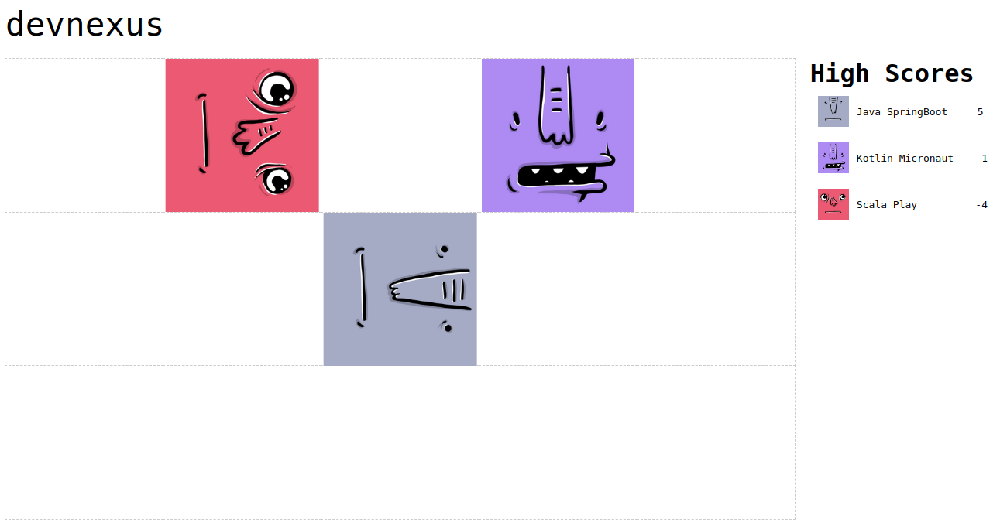
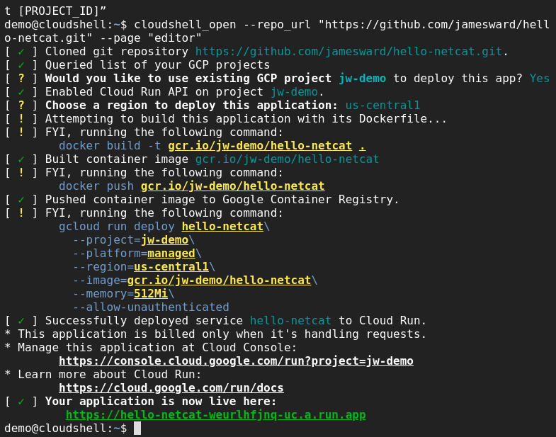
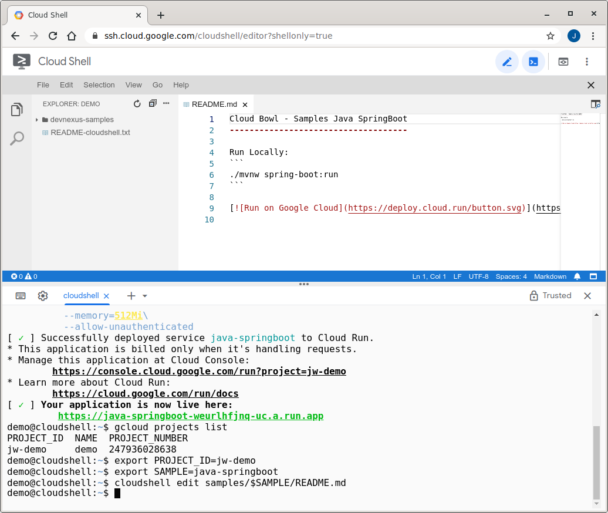

CloudBowl Instructions
----------------------

Ever been in a snowball fight where you move around and playfully throw snowballs at others? If not, try it someday! But now instead of risking getting physically smacked, you can build a small, network accessible service (a microservice) that will take part in an epic battle throwing snowballs or other objects at other microservices.

You might be wondering... But how does a microservice "throw" a snowball at other microservices? A microservice can receive network requests (usually over HTTP) and return responses. There is an "arena manager" that will send your microservice the current state of the arena and then your microservice will respond with a command specifying what to do.

Of course the goal is to win, but along the way you'll learn about building and deploying microservices on Google Cloud.

## How It Works

You will build a microservice with any technology you want (or start from Java, Kotlin, Scala, Go, Node.js, or Python examples) and then deploy the microservice on Google Cloud. Once deployed, you'll send a pull request to [the arena of your choice](README.md) and once merged your microservice will be added to the arena.

About once a second our arena manager will call your microservice, sending the current arena state (where the players are), and your microservice will respond with a command for what to do. In the arena you can move forward, turn left or right, or throw the object (which is different for each arena). A thrown object will travel up to three spaces in the direction the player is facing. If the object "hits" another player, the thrower gets one point and the hit player loses a point. The arena size is auto-adjusted for the current number of players.

Here is how the arena looks with three made-up players:



### Revolving Conflicts
In the arena it is possible that multiple players try to perform conflicting actions. For instance, two players might try to move to the same space or throw objects at each other. In the case of a conflict, the microservice with the quickest response time wins.

### Battle API
In order to work with our arena manager, your microservice will need to implement a specific API to participate in the arena. The arena manager will send the current arena state in an HTTP POST to the URL you provide us, with the following JSON structure:

```
{
  "_links": {
    "self": {
      "href": "https://YOUR_SERVICE_URL"
    }
  },
  "arena": {
    "dims": [4,3], // width, height
    "state": {
      "https://A_PLAYERS_URL": {
        "x": 0, // zero-based x position, where 0 = left
        "y": 0, // zero-based y position, where 0 = top
        "direction": "N", // N = North, W = West, S = South, E = East
        "wasHit": false,
        "score": 0
      }
      ... // also you and the other players
    }
  }
}
```

Your HTTP response must be status code 200 (OK) with a response body containing your next move, encoded as a single uppercase character of either:

```
F <- move Forward
R <- turn Right
L <- turn Left
T <- Throw
```

That's all there is to it! Let's walk through deploying a microservice on Cloud Run, a Google Cloud service for running microservices and other applications.

## Deploying Your Microservice

You can build your microservice with any technology and deploy it anywhere as long as it is reachable publicly and conforms to the Battle API. To make things easy you can start with a sample project that just picks a random command.

### Pick Your Sample To Start With

There are a number of battle microservice samples you can start from:

| Sample | Source | Deploy |
|--------|--------|--------|
| Java & Spring Boot | [Source][java-springboot-source] | [![Deploy][button]][java-springboot-deploy] |
| Java & Quarkus | [Source][java-quarkus-source] | [![Deploy][button]][java-quarkus-deploy] |
| Kotlin & Micronaut | [Source][kotlin-micronaut-source] | [![Deploy][button]][kotlin-micronaut-deploy] |
| Kotlin & Quarkus | [Source][kotlin-quarkus-source] | [![Deploy][button]][kotlin-quarkus-deploy] |
| Scala & Play Framework | [Source][scala-play-source] | [![Deploy][button]][scala-play-deploy] |
| Go | [Source][go-source] | [![Deploy][button]][go-deploy] |
| Node.js | [Source][nodejs-source] | [![Deploy][button]][nodejs-deploy] |
| Python | [Source][python-source] | [![Deploy][button]][python-deploy] |

[button]: https://deploy.cloud.run/button.svg
[java-springboot-source]: https://github.com/GoogleCloudPlatform/cloudbowl-microservice-game/tree/master/samples/java-springboot
[java-springboot-deploy]: https://deploy.cloud.run/?git_repo=https://github.com/GoogleCloudPlatform/cloudbowl-microservice-game.git&dir=samples/java-springboot
[java-quarkus-source]: https://github.com/GoogleCloudPlatform/cloudbowl-microservice-game/tree/master/samples/java-quarkus
[java-quarkus-deploy]: https://deploy.cloud.run/?git_repo=https://github.com/GoogleCloudPlatform/cloudbowl-microservice-game.git&dir=samples/java-quarkus
[kotlin-micronaut-source]: https://github.com/GoogleCloudPlatform/cloudbowl-microservice-game/tree/master/samples/kotlin-micronaut
[kotlin-micronaut-deploy]: https://deploy.cloud.run/?git_repo=https://github.com/GoogleCloudPlatform/cloudbowl-microservice-game.git&dir=samples/kotlin-micronaut
[kotlin-quarkus-source]: https://github.com/GoogleCloudPlatform/cloudbowl-microservice-game/tree/master/samples/kotlin-quarkus
[kotlin-quarkus-deploy]: https://deploy.cloud.run/?git_repo=https://github.com/GoogleCloudPlatform/cloudbowl-microservice-game.git&dir=samples/kotlin-quarkus
[scala-play-source]: https://github.com/GoogleCloudPlatform/cloudbowl-microservice-game/tree/master/samples/scala-play
[scala-play-deploy]: https://deploy.cloud.run/?git_repo=https://github.com/GoogleCloudPlatform/cloudbowl-microservice-game.git&dir=samples/scala-play
[go-source]: https://github.com/GoogleCloudPlatform/cloudbowl-microservice-game/tree/master/samples/go
[go-deploy]: https://deploy.cloud.run/?git_repo=https://github.com/GoogleCloudPlatform/cloudbowl-microservice-game.git&dir=samples/go
[nodejs-source]: https://github.com/GoogleCloudPlatform/cloudbowl-microservice-game/tree/master/samples/nodejs
[nodejs-deploy]: https://deploy.cloud.run/?git_repo=https://github.com/GoogleCloudPlatform/cloudbowl-microservice-game.git&dir=samples/nodejs
[python-source]: https://github.com/GoogleCloudPlatform/cloudbowl-microservice-game/tree/master/samples/python
[python-deploy]: https://deploy.cloud.run/?git_repo=https://github.com/GoogleCloudPlatform/cloudbowl-microservice-game.git&dir=samples/python

After you decide which sample to start with, click the "Run on Google Cloud" button above. This will launch Cloud Shell (a web-based console to a virtual machine in the cloud) where the source will be cloned, then built into a deployable package (a docker container image), which is then uploaded to the Google Container Registry, and then deployed on Cloud Run.

When asked, specify the `us-central1` region.



### Verify the microservice works
In Cloud Shell you can make a request to your newly deployed microservice, replacing `YOUR_SERVICE_URL` with the URL for your service (which is in Cloud Shell after the "Your application is now live here" line):

```
curl -d '{
  "_links": {
    "self": {
      "href": "https://foo.com"
    }
  },
  "arena": {
    "dims": [4,3],
    "state": {
      "https://foo.com": {
        "x": 0,
        "y": 0,
        "direction": "N",
        "wasHit": false,
        "score": 0
      }
    }
  }
}' -H "Content-Type: application/json" -X POST -w "\n" \
  https://YOUR_SERVICE_URL
```

You should see the response string of either F, L, R, or T.

### Request Inclusion in the Arena

To be included in an arena, [check out the arena list and pull request instructions](README.md).

### Make & Deploy Changes
Before you can make changes you need to setup some information in Cloud Shell about the GCP project and the sample you used. First list your GCP projects:
```
gcloud projects list
```

You likely only have one project. Copy the `PROJECT_ID` from the first column and paste it into the following command (replacing `YOUR_PROJECT_ID` with your actual Project ID), in order to set an environment variable that we will use in later commands:
```
export PROJECT_ID=YOUR_PROJECT_ID
```
Now set another environment variable for the sample you used so in later commands we can specify the correct directory and service name:
```
# Copy and paste ONLY ONE of these
export SAMPLE=java-springboot
export SAMPLE=java-quarkus
export SAMPLE=kotlin-micronaut
export SAMPLE=kotlin-quarkus
export SAMPLE=scala-play
export SAMPLE=go
export SAMPLE=nodejs
export SAMPLE=python
```
Now, you can edit the source for your microservice from within Cloud Shell. To open the Cloud Shell web-based editor, run this command:
```
cloudshell edit cloudbowl-microservice-game/samples/$SAMPLE/README.md
```

You will then see further instructions for making changes.



After saving your changes, build your project in Cloud Shell using the pack command. This command uses Buildpacks to detect the project type, compile it, and create the deployable artifact (a docker container image).

```
pack build gcr.io/$PROJECT_ID/$SAMPLE \
  --path cloudbowl-microservice-game/samples/$SAMPLE \
  --builder heroku/buildpacks
```

Now that your container image has been created, use the docker command (in Cloud Shell) to push the container image to the Google Container Registry so that it can then be accessed by Cloud Run:
```
docker push gcr.io/$PROJECT_ID/$SAMPLE
```

Now deploy the new version on Cloud Run:

```
gcloud run deploy $SAMPLE\
          --project=$PROJECT_ID\
          --platform=managed\
          --region=us-central1\
          --image=gcr.io/$PROJECT_ID/$SAMPLE\
          --memory=512Mi\
          --allow-unauthenticated
```

Now the arena will use your new version!

## Congratulations

Congratulations, you've successfully built and deployed a microservice that can battle with other microservices! Good luck!